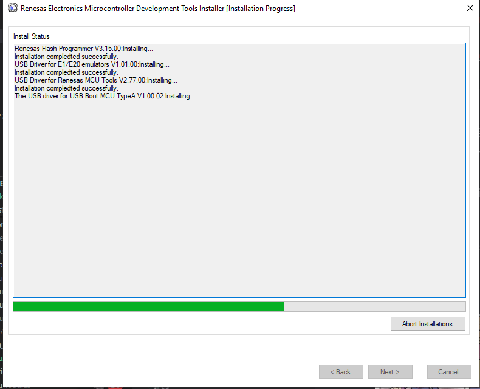
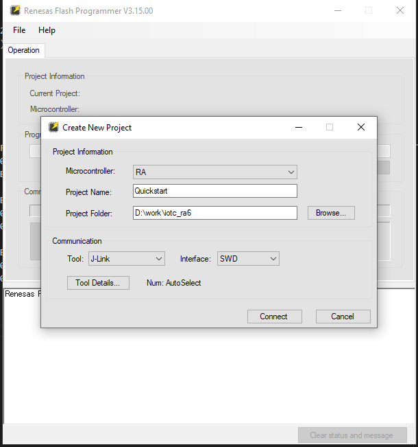
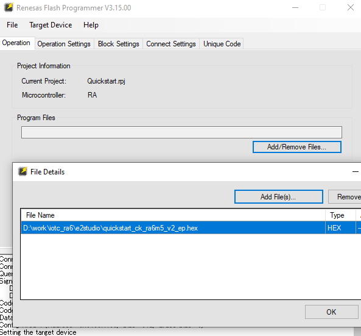

# Quickstart

The binary image is located at `e2studio/` (`.hex` extension).

To flash the image, please download the [Renesas Flash Programmer](https://www.renesas.com/us/en/software-tool/renesas-flash-programmer-programming-gui#downloads).

At the time of writing, the latest version is **3.15**.

# Flashing

## Linux

Unpack the `RFP_CLI` archive downloaded from the link above (e.g. `RFP_CLI_Linux_V31500_x64.tgz`).

The resulting folder should have the necessary `rfp-cli` program.

Connect your board using the USB cable.

To flash the image, use the `rfp-cli` tool with the `-device RA -tool jlink -if swd -a` parameters. 

Here is an example:

```
~/work/iotconnect/test $ linux-x64/rfp-cli -device RA -tool jlink -if swd -a ./e2studio/quickstart_ek_ra6m4_ep.hex 

Renesas Flash Programmer CLI V1.09
Module Version: V3.15.00.000
Load: "/home/user/work/test/e2studio/quickstart_ek_ra6m4_ep.hex" (Size=953512, CRC=CD28FC17)

Connecting the tool (J-Link)
      J-Link Firmware: J-Link OB-S124 compiled Oct 30 2023 12:13:12
Tool: J-Link (SEGGER J-Link-OB-S124)                                            
Interface: SWD

Connecting the target device
Speed: 1,500,000 Hz
Connected to RA

Erasing the target device
  [Code Flash 1]       00000000 - 000FFFFF
  [Data Flash 1]       08000000 - 08001FFF                                      
  [Code Flash 1]       00000000 - 00057FFF                                      
Writing data to the target device                                               
  [Code Flash 1]       00000000 - 00052B7F
  [Config Area 1]      0100A100 - 0100A11F                                      
  [Config Area 1]      0100A130 - 0100A13F                                      
  [Config Area 1]      0100A200 - 0100A2CF                                      
Verifying data on the target device                                             
  [Code Flash 1]       00000000 - 00052B7F
  [Config Area 1]      0100A100 - 0100A11F                                      
  [Config Area 1]      0100A130 - 0100A13F                                      
  [Config Area 1]      0100A200 - 0100A2CF                                      
                                                                                

Disconnecting the tool

Operation successful
```


## Windows

Install the Renesas Flash Programmer with default settings and launch it. Make sure your target RA6 board is connected.



Using `File` - `New Project`, create a new project.

Select `RA` as Microcontroller, `J-Link` as Tool, and `SWD` as Interface.



Press `Connect`.

You should now have a successful connection.


Next, select `Add/Remove Files...`, click `Add File(s)...`, navigate to the `e2studio` folder and select the `.hex` file.



Click OK.

Press **Start** to start the flashing process.

A progress window will pop up.

At the end an `Operation Completed.` message will remain in the status box.


# Usage 

Once the device is flashed, the device will boot and start sending out telemetry.

Assuming your DA16x00 device is connected to the correct PMOD port and is configured to connect to your IoTConnect instance correctly, the telemetry will be visible in your IoTConnect dashboard.

Commands may be sent to the device as supported (refer to the [README](./README.md)).